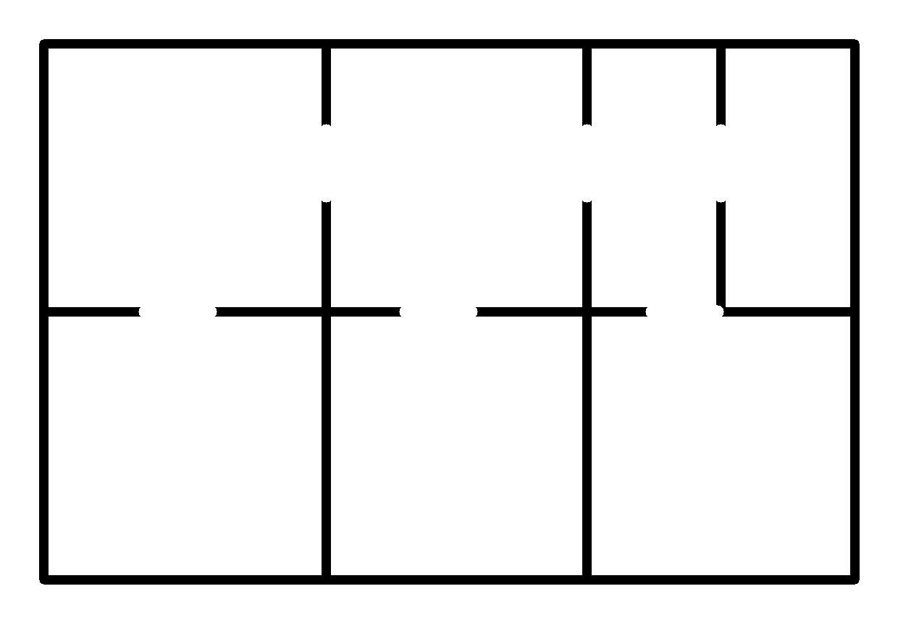

# Floor Plan Vectorizer

A [Claude](https://claude.com) **skill** that turns a raster image of an
architectural floor plan into a clean, **interactive, measured SVG**. Every
enclosed room becomes its own clickable `<path>` with a stable id; the real wall
structure is rendered as a layer; and each room is labelled with its floor area
in m² or ft².

Built for architects, designers, and developers who want clickable, measurable
plans on the web — building directories, apartment finders, space-planning
tools, room schedules / area takeoffs.



## What it does

- **Room detection that reads like a plan.** Walls are detected, doorways are
  sealed automatically, and each enclosed space becomes an interactive region —
  with the wall structure drawn on top, not flat coloured boxes.
- **Real areas.** Give it a drawing scale (calibrate from any known dimension,
  or pass pixels-per-metre) and every room gets a floor area in m² or ft², plus
  a total.
- **Interactive by default.** The SVG ships with hover styling and a tiny script
  that fires a `room:select` event on click / Tab+Enter — no framework needed.
- **Stable, meaningful ids.** Name rooms with `--labels` and they become slugged
  ids (`room-kitchen`) and on-plan text.
- **Room schedule & demo.** `--manifest` emits a JSON schedule; `--demo` emits a
  standalone viewer page.
- **Light dependencies.** Only `numpy` and `opencv-python`.

## Quick start

```bash
pip install numpy opencv-python

# Auto-detect rooms (sealing tunes itself), write apartment.svg:
python scripts/vectorize.py apartment.png

# Calibrate scale from a known 11.20 m wall, name rooms, emit schedule + demo:
python scripts/vectorize.py apartment.png \
  --calibrate "60,800,1180,800,11.2" \
  --labels "Living,Kitchen,Bedroom,Bedroom 2,Bath,WC,Closet" \
  --manifest --demo

# Report areas in square feet:
python scripts/vectorize.py apartment.png --scale 100 --units ft
```

Open the generated `*.demo.html` to click around the plan.

## Using the SVG in your app

```html
<!-- paste the generated <svg> ... </svg> here -->
<script>
  document.querySelector('.floorplan').addEventListener('room:select', e => {
    // e.detail = { id, label, areaPx, area }
    console.log('selected', e.detail.label, '=', e.detail.area, 'm²');
  });
</script>
```

Style rooms by id, or via the `.room` and `.is-selected` classes. Pass
`--static` to omit the script and wire up your own behaviour.

## Setting the scale

Areas need a scale. Either calibrate from a dimension you can measure on the
image:

```bash
# pixels (x1,y1)->(x2,y2) span a wall that is 5.00 m long:
--calibrate "120,840,740,840,5.0"
```

…or pass pixels-per-metre directly with `--scale`. Without a scale, rooms are
still detected and clickable; only the area figures are omitted.

## Installing as a Claude skill

Drop the `floorplan-vectorizer/` folder into your skills directory (Claude Code
/ Cowork). Claude triggers it when you ask to vectorize a floor plan, make a
plan interactive, detect rooms, or compute room areas from a plan image. See
[`SKILL.md`](SKILL.md) for the instructions Claude follows and
[`references/tuning.md`](references/tuning.md) for tuning.

## Options

Run `python scripts/vectorize.py --help` for everything. Highlights:

| Flag | Meaning |
|------|---------|
| `--calibrate "x1,y1,x2,y2,len_m"` / `--scale PX_PER_M` | set the drawing scale |
| `--units m\|ft` | area units |
| `--labels "A,B,C"` | name rooms (descending area) |
| `--manifest` / `--demo` | emit room schedule JSON / viewer HTML |
| `--static` | static SVG, no script |
| `--wall-method fixed` `--threshold N` | for clean/grey-wall plans |
| `--min-area F` | drop rooms below fraction F of the image |

## Examples

[`examples/`](examples/) contains a worked apartment plan: source PNG, the
generated `.svg`, the `.json` room schedule, and the `.demo.html` viewer.

## License

MIT — see [LICENSE](LICENSE).
